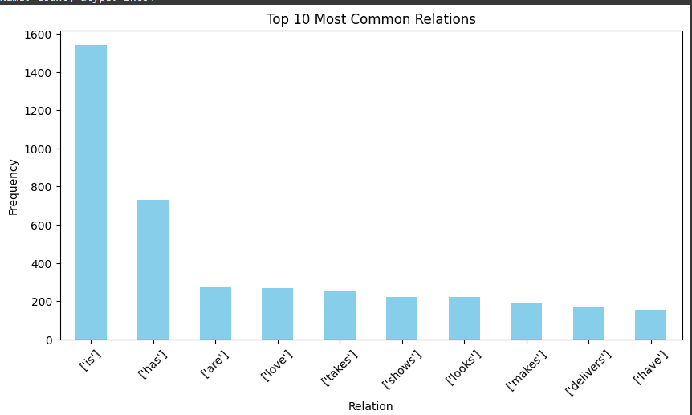
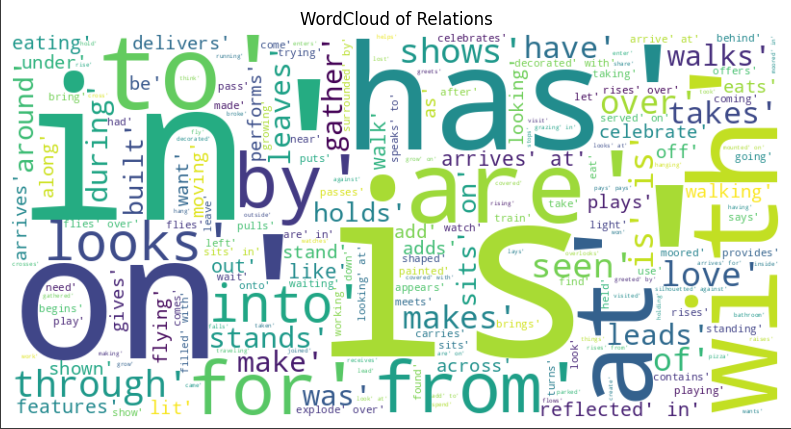
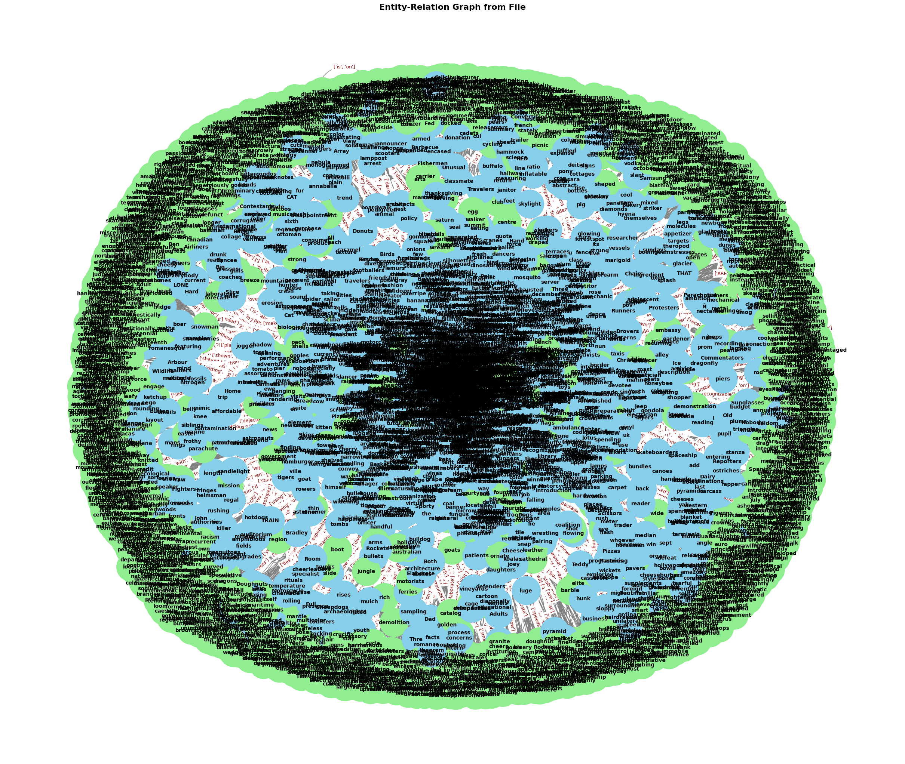
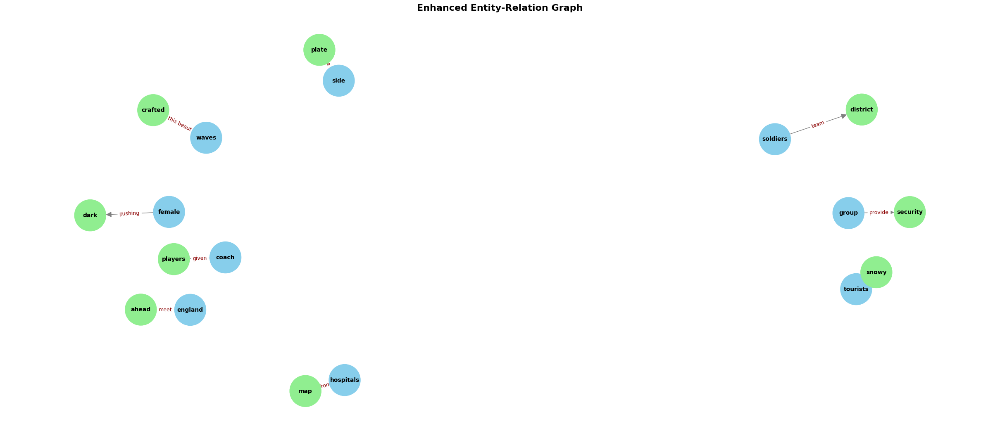

# Semantic Dataset Analysis - Phase 2

## Group Members
| Name          | Roll Number          |
| -------------- | --------------------- |
| Shazia Nazir   | NUM-BSCS-2022-09       |
| Ayesha Tahir   | NUM-BSCS-2022-17       |

**Instructor**: Sir Muhammad Bilal  
**Course**: Data Analysis and Visualization  
**Department**: Computer Sciences, Namal University Mianwali, Pakistan

---

## Task 1: Exploratory Data Analysis (EDA)

The EDA performs an in-depth exploratory data analysis on the knowledge graph dataset (`kG nlp.csv`). The goal is to understand entity relationships through visual and statistical techniques.

### Visualization

#### Non-Graphical Visualization
- Frequency counts for the most common `relation`, `source`, and `target` columns.

#### Graphical Visualization
- **Top 10 Relations** and **Top 10 Entities** visualized using bar plots.

**Bar Plot - Top 10 Most Common Relations**

**Bar Plot - Top 10 Most Common Entities**

- **WordCloud** generated for visualizing relation distributions.

**WordCloud of Relations**

---

## Task 2: Entity-Relation Graph Visualization

Visualizes the structure of relationships between entities using a Directed Graph (`DiGraph`).

- Nodes are categorized:
  - **Source entities**: Sky Blue
  - **Target entities**: Light Green
- Edges represent the relationships.

**Entity-Relation Graph**

### Interpretation
- Central clusters represent entities with a high degree of connectivity.
- Peripheral entities have fewer relationships.
- Provides insights into semantic density and dominant entities.

---

## Task 3: Enhanced Entity-Relation Graph Visualization

This task focuses on a smaller sample for better readability and interpretability.

**Enhanced Entity-Relation Graph (Sampled)**

### Example Insights
- `"group" → "security"` labeled `"provide"` suggests functional roles.
- `"coach" → "players"` labeled `"given"` highlights contextual relationships in sports.

---

## Task 4: Triplet Extraction

Converts raw dataset entries into structured (Source, Relation, Target) triplets for:
- Visualization
- Analysis
- Machine learning tasks

---

## Task 5: Predict Most Relevant Relation

Develops a prediction script using **fuzzy string matching** (via `fuzzywuzzy`) to infer the most likely relation between any two user-provided entities.

---

## Conclusion

In this phase, we:
- Explored entity relationships visually and statistically.
- Identified dominant entities and important semantic clusters.
- Extracted structured triplets for downstream tasks.
- Built a basic relation prediction model using fuzzy matching.

This analysis provided meaningful insights into the semantic structure and connectivity of entities within the dataset.

---
